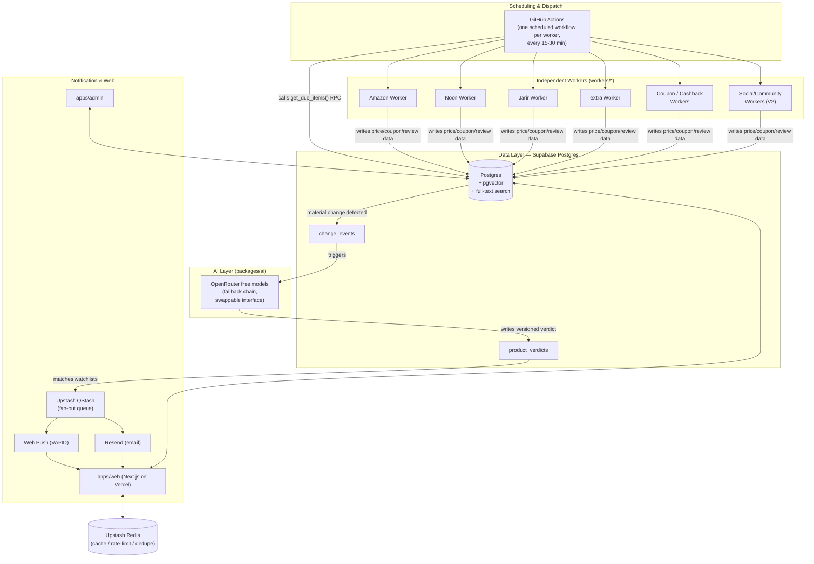

# System Architecture
## AI Shopping Intelligence Platform — Saudi Arabia → MENA

| | |
|---|---|
| **Status** | v1.2 — Approved and complete (all decisions in §7/§8/§8b resolved 2026-07-10) |
| **Phase** | 2 of 10 — System Architecture |
| **Last updated** | 2026-07-10 |
| **Depends on** | `PRD.md` (Phase 1, approved — all §17 questions resolved) |
| **Next document** | `DEPLOYMENT.md` (Phase 3) once this is approved |

> **Governance note.** This document decides *component-level* architecture — which system does what, and how they talk to each other — grounded specifically in the PRD's MVP constraint: **personal/limited-scale usage, cost as close to $0/month as possible, cheapest-that's-still-genuinely-good over best-in-class** (PRD §7.2, §11, §17 Q4). It does **not** finalize database schemas, exact infra sizing, or per-worker implementation detail — those are Phases 3–6. Every pricing/limit claim below was verified via live research in July 2026 (sources inline), not assumed from training knowledge, because getting this wrong would directly misinform a cost-sensitive decision.

---

## 1. Guiding Principles

1. **One architecture, two deployments.** The system is *designed* to scale to millions of products/users (PRD's non-negotiable long-term requirement) but is *deployed* at MVP using free/hobby tiers and consolidated services. Scaling later means swapping a component behind an unchanged interface, not a rewrite.
2. **Consolidate before you distribute.** Every additional always-on service is a cost floor and an operational burden. Prefer one system (Postgres) doing more jobs (relational + full-text search + vector) over three specialized systems, until a measured threshold says otherwise.
3. **Serverless/scheduled over always-on.** No component runs 24/7 unless it must. Background work runs on triggers and schedules, not idle daemons — this is also what makes the cost floor near-zero.
4. **Worker isolation is free if designed right.** Running each worker as its own process/workflow, rather than threads inside one service, gets "one worker's failure never affects another" (PRD FR-8, NFR-Reliability) essentially for free — no extra infrastructure required.
5. **AI runs on data changes, not on a clock.** The single biggest cost and correctness lever in the whole system is FR-14 ("re-run AI analysis only when underlying data materially changes") — bigger than which AI provider/model is chosen. The architecture makes this a hard gate, not an optimization.
6. **Every deviation from the founder's named stack is a decision, not a default.** Where this document departs from the original brief (Railway, Elastic/Meilisearch, dedicated vector DB, multi-provider AI), it says so explicitly with a trade-off and a graduation trigger — see §7.

---

## 2. High-Level System Diagram



---

## 3. Component Architecture

### 3.1 Frontend & API — Next.js on Vercel

- `apps/web` (public) and `apps/admin` (internal ops) deploy to **Vercel Hobby (free)**. Limits: 100GB bandwidth, 1M function invocations, 4hrs Active CPU, 60s function timeout. [Vercel Docs; Fencode, 2026]
- `apps/api` is **not** a separate long-running service. It is Next.js Route Handlers / Serverless Functions on the same Vercel deployment, talking directly to Supabase Postgres. This removes an entire always-on API tier at MVP scale.
- **Constraint to track:** Vercel Hobby's terms are non-commercial-use only. This is fine today (zero live monetization per PRD §13) but is a hard trigger to upgrade to **Pro (~$20/mo)** the moment any affiliate/sponsored revenue feature ships — tracked as an infra action item, not a silent risk.

### 3.2 Database — Supabase Postgres as the single system of record

**Decision: use Postgres itself (via `pgvector` and native full-text search) instead of standing up a separate search engine and a separate vector database at MVP.** See §7.2/§7.3 for the full trade-off — this is a named deviation, flagged for approval.

- **Supabase Free tier:** 500MB database, 1GB file storage, 5GB egress/month, 50,000 MAU, `pgvector` included. **Pauses after 7 days of DB inactivity**, ~30s cold-start resume. [Supabase pricing docs, 2026]
- **Full-text search:** Postgres FTS is production-adequate up to roughly hundreds of thousands of rows / low-hundreds of QPS — comfortably above MVP's 1,000–5,000 tracked products.
- **Vector search:** `pgvector` (HNSW index) performs well up to ~5–10M vectors — used for review-similarity and semantic product matching, far above MVP volume.
- **Known limitation:** `pg_cron` (in-database scheduled jobs) requires Supabase **Pro tier**, not available free. This is why scheduling is driven externally (§3.5), not from inside Postgres.

### 3.3 Cache / Queue — Upstash (Redis + QStash), serverless and request-metered

- **Upstash Redis Free:** 256MB data, 500,000 commands/month. Used for hot product/price cache, rate-limiting, and scheduler dedupe sets. [Upstash pricing, 2026]
- **Upstash QStash Free:** 1,000 messages/day, 1,000 free active schedules — used as the lightweight delivery queue for notification fan-out (§3.7), avoiding a dedicated message broker (Kafka/RabbitMQ/SQS) at this scale.
- **Why not Railway Redis:** Railway removed its free tier; Hobby is a **guaranteed $5/month floor plus usage** even at zero traffic. Upstash's pure pay-per-request model has no floor cost. [Railway docs, 2026]

### 3.4 Background Workers — GitHub Actions scheduled workflows (Playwright runtime)

This is the largest deviation from the originally-named stack (Railway) — flagged in §7.1.

- Each retailer/source worker (`workers/amazon`, `workers/noon`, `workers/jarir`, `workers/extra`, and later `workers/coupon`, `workers/cashback`, `workers/reddit`, `workers/x`, `workers/youtube`, `workers/tiktok`) is its **own GitHub Actions workflow file**, on its own cron schedule.
- **Free allowance:** public repos get unlimited Actions minutes; private repos get 2,000 min/month free, Linux runners (2-core/7GB), jobs can run up to 6 hours. [GitHub Docs, 2026]
- Each workflow run: (1) calls a scheduler API to get its prioritized batch (§3.5), (2) runs Playwright headless Chromium against that batch, (3) writes results to Postgres, (4) exits. No process to keep alive, no crash-loop risk.
- **This gets worker-failure-isolation (PRD FR-8) essentially for free**: a Playwright crash in the Amazon workflow runs in a completely separate VM from Noon's — they cannot affect each other by construction, not by careful coding.
- **Known limitation:** GitHub Actions cron has a hard 5-minute minimum interval, is UTC-rooted (per-schedule timezone support added 2026), and scheduled runs can be delayed 5–30 minutes under platform load. Treated as a *coarse dispatcher*, not a precision scheduler — see §3.5.

### 3.5 Scheduler — priority computed in Postgres, dispatched coarsely by GitHub Actions

Not "crawl everything on a fixed timer" (explicitly rejected by PRD). Concrete design:

1. `products` table carries `popularity_score`, `volatility_score` (variance of recent price history), `last_checked_at`, and a computed `check_interval` — shrinks for high-popularity/high-volatility products, grows for long-tail ones.
2. A Postgres RPC function (`get_due_items(source, limit)`, called directly via `supabase.rpc()` — formalized in `API.md` §1/§3.1 of `WORKERS.md`) returns the top-N most-overdue, highest-priority products for that retailer, computed via a SQL query — **the actual intelligence lives in SQL, not in the cron expression, and not behind an HTTP API layer either.**
3. Each retailer's GitHub Actions workflow fires every 15–30 minutes, calls this endpoint, and scrapes exactly that batch.
4. Scaling path: when one workflow run can no longer cover its polling interval, shard by category or hash into additional workflow files — no re-architecture needed, just more files.

This satisfies the PRD's explicit requirement that the scheduler is "foundational, not an optimization to defer," entirely inside the free tier.

### 3.6 AI Layer — free open-weight models via OpenRouter, behind a swappable interface

**Decision (revised 2026-07-10): ship MVP on genuinely free AI — OpenRouter's `:free` model tier — not Claude.** The founder chose true $0 over paid-but-better-quality (see §7.4 for the full trade-off).

- **Interface shape unchanged:** `generateVerdict(input): Promise<Verdict>` in `packages/ai` — call sites never touch a provider SDK directly. This is what makes the provider swap a config change, not a rewrite, whichever direction it goes later.
- **Provider: OpenRouter**, calling 2–3 free (`:free`-suffixed) open-weight models in a fallback chain (e.g., a strong reasoning-oriented free model as primary, a second free model as automatic fallback on error/timeout/rate-limit) — this exists specifically because free-tier models individually have lower availability guarantees than a paid API, so redundancy across free models substitutes for the reliability a single paid provider would give.
- **OpenRouter free-tier limits (verified July 2026):** **20 requests/minute**, and a **daily cap of 50 requests/day on a $0 account, rising to 1,000 requests/day after a one-time $10 top-up (the $10 never expires and is not a subscription)**. [openrouter.ai/docs, klymentiev.com, costbench.com, 2026]
- **Practical sizing:** at true personal-watchlist scale (a handful of categories, not the full 1,000–5,000-product ceiling actively re-analyzed daily), 50 req/day is workable if AI calls are strictly gated by FR-14 (material change only) and batched/throttled — but it is tight, and a busy day (e.g., adding many watchlist items, or a big multi-product price-drop event) can hit the cap. **Recommended, still-$0-recurring path: the one-time $10 OpenRouter top-up** — it is a single non-recurring purchase (not a subscription), after which the 1,000 req/day ceiling comfortably covers MVP scale indefinitely at no further cost. This is presented as an option, not applied by default — flagged in §8 for a decision.
- **Model allocation by task:** the same task split as before (reasoning-heavy buy-now-vs-wait verdicts and review synthesis vs. lighter structured extraction) still applies — it's just mapped to free-model equivalents (a stronger free reasoning model for the former, a smaller/faster free model for the latter) instead of Sonnet/Haiku.
- **Quality trade-off, stated plainly:** free open-weight models are not at Claude Sonnet's level for nuanced, cited reasoning — this is a deliberate cost/quality trade the founder made explicitly (§7.4), not an oversight. Because the interface is swappable, any specific task where free-model quality visibly fails the PRD's "explainable, trustworthy verdict" bar (§5) can be upgraded to a paid model *for that task only* without touching the rest of the system.

### 3.7 Auth — Supabase Auth (bundled, free)

Included in the Supabase free tier (up to 50,000 MAU), integrates with Postgres Row-Level Security for per-user data isolation (watchlists, notification preferences). `packages/auth` is a thin wrapper around the Supabase Auth SDK — no custom session/JWT infrastructure to build or maintain.

### 3.8 Notifications — Web Push + Resend (matches PRD FR-16: push + email only at MVP)

- **Web Push (VAPID):** browser standard, genuinely $0, no vendor dependency.
- **Resend Free:** 3,000 emails/month, **capped at 100/day**. The daily cap (not the monthly one) is the real constraint — flagged as an MVP risk (§8) given a single popular alert could burst past it. Push is prioritized as the primary channel for exactly this reason; email is secondary.
- Delivery is fanned out via Upstash QStash (§3.3) for retryable, at-least-once delivery without a heavy broker.

### 3.9 Monorepo — Turborepo

Recommended over Nx for MVP: lighter, first-class Vercel integration (same vendor, zero-config remote caching), sufficient for the requested layout:

```
apps/            web (includes /admin route, gated by role — see §8.3; api folded in as Route Handlers, §3.1)
packages/        ui · shared · database · auth · ai
workers/         amazon · noon · jarir · extra · coupon · cashback · reddit · x · youtube · tiktok
services/        scheduler · notification · search · recommendation
```

`services/*` at MVP scale are mostly thin logic modules called from API routes or worker scripts (e.g., `services/scheduler` is the SQL/query logic behind §3.5, not a standalone daemon) — they become independently deployable services later without changing their public interface, per Principle 1.

### 3.10 Event Flow — the core loop (no heavy broker)

```
GitHub Actions (per-worker, ~every 15-30 min)
  → calls scheduler API for prioritized batch
  → Playwright scrapes that batch
  → writes to Postgres: price_history (append-only, FR-2), products.last_checked_at
  → IF material change (price delta, stock flip, new coupon, rating shift):
      write change_events row  ← this gate satisfies FR-14
  → change_events triggers AI re-analysis (Postgres trigger/webhook or lightweight poller)
  → packages/ai (OpenRouter free models) generates updated verdict → product_verdicts (versioned, auditable)
  → recommendation matcher checks watchlists for users whose criteria now match
  → Upstash QStash fans out → Web Push / Resend email
  → user clicks through → apps/web reads product_verdicts + price_history for the full explanation
```

Every verdict references the `change_event` and data snapshot that produced it — satisfying the PRD's auditability NFR ("every AI-generated recommendation must be traceable to the data it used").

---

## 4. Cost Summary

| Component | MVP choice | Est. $/month | Graduation trigger |
|---|---|---|---|
| Frontend/API | Vercel Hobby | $0 | Any live monetization (ToS), or traffic exceeds Hobby caps |
| Database | Supabase Free | $0 | DB > 500MB, need `pg_cron`, need to remove 7-day pause |
| Search | Postgres FTS | $0 | Catalog > ~200–500K products, or p95 search latency > 300ms |
| Vector | pgvector | $0 | Vector count > 5–10M |
| Cache/Queue | Upstash Redis + QStash Free | $0 | > 500K Redis commands/mo or > 1K QStash msgs/day |
| Workers | GitHub Actions | $0 (2,000 min/mo private) | Minutes exhausted, or need sub-5-min precision |
| AI | OpenRouter free models (`:free` tier) | $0 (or one-time non-recurring $10 for higher daily cap — §8) | Free-model quality visibly fails the "trustworthy verdict" bar on a specific task (upgrade that task only), or daily request cap (50, or 1,000 post-topup) is consistently insufficient |
| Auth | Supabase Auth | $0 | > 50,000 MAU |
| Notifications | Web Push + Resend Free | $0 | > 100 emails/day sustained |
| Monorepo tooling | Turborepo | $0 | Team scale needs Nx's generators/graph tooling |
| **Total** | | **$0/month recurring** (optional one-time, non-recurring $10 OpenRouter top-up — §8) | |

---

## 5. Traceability to PRD Requirements

| PRD requirement | How this architecture satisfies it |
|---|---|
| FR-1 to FR-8 (data collection) | §3.4 independent per-source GitHub Actions workers |
| FR-9 to FR-14 (AI intelligence) | §3.6 AI layer + §3.10 change-gated re-analysis (FR-14) |
| FR-15 to FR-20 (user-facing) | §3.1 Next.js web app + §3.7 Auth + §3.8 notifications |
| FR-21 to FR-23 (admin/ops) | Role-gated `/admin` route inside `apps/web` (§8.3), reads worker run status via GitHub Actions API + Postgres |
| NFR Scalability | Principle 1 — every component has a named graduation path (§4) that doesn't require redesign |
| NFR Cost Efficiency | §3.5 popularity/volatility-weighted scheduler; §4 $0/month recurring MVP cost |
| NFR Reliability (worker isolation) | §3.4 — isolation by construction (separate VMs), not by careful coding |
| NFR Auditability | §3.10 — every verdict traces to its triggering change_event |
| §13 Monetization (sponsored vs. organic separation) | Architecturally: sponsored placement must be a separate, clearly-flagged field on listings, never blended into the `product_verdicts` ranking logic — call out explicitly in Phase 8 (API design) |

---

## 6. Risks Specific to the Cheap/Free-Tier Choices

| Risk | Impact | Mitigation |
|---|---|---|
| Supabase free project pauses after 7 days of inactivity | A request or scheduled worker hits a paused DB, times out | Self-mitigating: workers touch the DB every 15–30 min at MVP cadence. Add a scheduled healthcheck ping as backstop. |
| GitHub Actions cron: 5-min minimum, UTC-rooted, up to 5–30 min delay under load | Cannot guarantee true real-time freshness; Y1 target of <30 min staleness is not reachable on pure cron dispatch | Treat as coarse dispatcher only (§3.5); document MVP freshness target as best-effort/cron-based (already reflected in PRD §7.2); graduating past this requires a real scheduler service later |
| ~~GitHub Actions private-repo free minutes (2,000/mo) can be exhausted~~ | — | **Resolved (§8.2):** repo is public, so Actions minutes are unlimited/free — no longer a risk |
| OpenRouter free-model tier caps at **50 requests/day** (or 20/min) — accepted as-is per §8b (no top-up) | AI re-analysis could stall mid-day on a busy day (many watchlist changes / a big price-drop event), delaying verdicts and notifications | Gate all AI calls behind FR-14's change-detection gate (never call on a timer); queue overflow requests into the next day's quota window rather than failing silently — raw data (price/coupon/review) is still collected and stored on schedule regardless, only AI verdict generation is deferred (§8b). The $10 top-up remains available as a zero-risk lever if this proves consistently binding. |
| Free open-weight models (OpenRouter `:free` tier) have lower availability/uptime guarantees than a paid API, and can be deprecated or swapped by OpenRouter with little notice | A single free model going down or disappearing could silently degrade verdict quality or break the AI layer | §3.6's 2–3-model fallback chain within `packages/ai` — if the primary free model errors or times out, automatically retry against the next model in the chain before failing |
| Vercel Hobby: 60s function timeout, hard caps, no overage billing | Any accidentally-long request hard-fails; hitting a cap takes the site offline until next month/upgrade | Keep AI calls and scraping entirely off the user-request path (already true per §3.10 — they run via the async change-detection flow, not inline) |
| Vercel Hobby is non-commercial-use only | ToS violation risk once monetization (§13 PRD) goes live | Explicit gate: upgrade to Pro before/at the same time as any affiliate/sponsored feature ships |
| Upstash Redis free caps at 500K commands/month | Cache/rate-limit logic could degrade during a traffic spike (White Friday, Ramadan) | Fallback to direct Postgres read on cache miss (degraded, not broken); budget cheap pay-as-you-go overage ahead of known seasonal spikes |
| Resend free caps at 100 emails/day | A single popular alert event could exceed the daily cap and drop/queue emails | Push notifications (free, uncapped) are the primary channel by design; email is secondary/digest |
| pgvector/Postgres FTS co-located with transactional workload | A heavy AI batch or search query could contend with user-facing reads | Keep AI/search queries read-light and indexed; Supabase compute pressure is the leading signal for graduating to a dedicated search/vector service, even before scale thresholds are hit |
| GitHub Actions auto-disables scheduled workflows on inactive repos | Data collection silently stops if the repo goes quiet | Any commit re-enables workflows; add a monthly keepalive commit or alert if no workflow runs occur beyond the expected interval |
| Multiple stacked "best-effort" free tiers, no SLA anywhere | Compounding availability risk across Supabase/Vercel/Upstash/GitHub Actions simultaneously | **Deliberately accepted** — PRD §7.2 explicitly sets MVP reliability target as "best-effort (free/hobby-tier hosting)," not 99.9%. Documented here so it's a decision, not a surprise. |

---

## 7. Deviations From the Founder's Named Stack — Approval Needed

The original brief named: Next.js, React, TypeScript, TailwindCSS, Shadcn UI, **Railway**, Supabase Postgres, Redis, Playwright, **vector DB**, **Elastic/Meilisearch**, OpenAI, Claude, **multi-provider AI**, GitHub, Vercel. Per PRD §17 Q5 (resolved: stack is a default direction, open to a better-justified alternative), here is every place this document departs from it:

### 7.1 Railway → GitHub Actions (workers)
**Trade-off:** Railway gives a real always-on container with no execution-time limit; GitHub Actions is free at this scale but has 5-min cron granularity, UTC-rooted scheduling, and no state between runs. **Why recommended anyway:** worker isolation (a hard requirement) is *stronger* on GH Actions — fully separate VMs per workflow — than on one Railway service running multiple workers, and it costs $0 vs. Railway's $5/mo floor. Reintroduce Railway at V1 once precision/statefulness needs outgrow cron.

### 7.2 Elastic/Meilisearch → Postgres full-text search
**Trade-off:** loses typo-tolerance and dedicated relevance tuning from day one; gains zero extra infrastructure and zero index/DB sync lag. **This is a user-facing search-quality trade, not just a cost trade** — flagging for explicit sign-off, not just noting as an infra detail. Acceptable at MVP catalog size (1,000–5,000 products), with a named graduation trigger (§4).

### 7.3 Dedicated vector DB → pgvector on the same Postgres instance
**Trade-off:** one database instead of three, but couples vector workload to the same compute as the transactional DB. Acceptable at MVP embedding volume; the mitigation and graduation trigger are in §6/§4.

### 7.4 Multi-provider AI → free open-weight models via OpenRouter, behind a swappable interface
**Original recommendation was Claude-only** (paid, ~$5–15/month, higher quality). **Founder decision (2026-07-10): true $0 preferred over paid-but-better-quality.** Revised to OpenRouter's free (`:free`) model tier, with a 2–3-model fallback chain for reliability (§3.6). **Trade-off, stated plainly:** free open-weight models are meaningfully behind Claude Sonnet on nuanced reasoning/citation quality, which is the exact axis the PRD's "explainable, trustworthy verdict" product principle (§5) cares about — this is a real quality cost, not just an infra one, knowingly accepted. Mitigations: (a) the swappable interface means any single task can be upgraded to a paid model later without touching the rest of the system; (b) OpenRouter's one-time (non-recurring) $10 top-up raises the daily request ceiling from 50 to 1,000 — recommended even under a "$0 recurring cost" philosophy, since it is not a subscription; flagged as a decision in §8, not applied by default.

### 7.5 Vercel Hobby's non-commercial ToS
Not a stack deviation but a constraint worth surfacing here: acceptable today (zero monetization), becomes a required upgrade the moment §13 monetization ships.

### 7.6 Decision (2026-07-10): §7.1–7.4 approved, with one explicit condition

Founder approved all four deviations, on the condition that **going cheap must never mean going feature-incomplete** — the free-tier stack must still deliver every PRD functional requirement (FR-1 through FR-23) in full, not a stripped-down MVP feature set. This is now a binding design rule, distinct from the cost trade-offs already documented above:

- What free-tier choices are allowed to cost: **polish, precision, and scale headroom** — e.g., search without typo-tolerance (§7.2), cron-based rather than sub-30-min freshness (§6), best-effort rather than 99.9% uptime (PRD §7.2, deliberately accepted).
- What free-tier choices are **not** allowed to cost: **any functional capability in the PRD.** Every FR must work end-to-end on this stack — price history (FR-2), fake-discount detection (FR-3), coupon validation (FR-4), cashback (FR-5), review synthesis (FR-12), buy-now-vs-wait verdicts (FR-9), alternative-product suggestions (FR-10), watchlists with standing criteria (FR-15), proactive notifications (FR-16), full price-history charts (FR-17), bilingual RTL UI (FR-19), admin worker-health visibility (FR-21), etc. None of these are cut or deferred by this architecture — they are all buildable on the components chosen in §3; the free tiers constrain *how well/fast*, not *whether*.
- Where a feature's quality genuinely cannot be delivered on the free tier (none identified yet at MVP's 1,000–5,000-product scale), that must be raised explicitly as a scope conversation, not silently degraded.

This condition is carried forward as a standing constraint into Phases 5–9 (AI Agents, Workers, Schedulers, APIs, UI) — each of those documents must show how its features run on this stack, not assume a richer one.

---

## 8. Decisions Recorded (2026-07-10)

1. **§7.1–7.4 deviations: approved**, subject to the binding "no feature cut" condition in §7.6.
2. **Repository visibility: public.** Unlocks unlimited free GitHub Actions minutes for the worker workflows (§3.4), removing the 2,000 min/month private-repo ceiling entirely — the single biggest constraint in §6's risk table is now moot. Trade-off accepted: source code and scraping logic are publicly visible. **Implication for later phases:** `SECURITY.md` (future) must ensure no secrets/API keys/credentials ever live in the repo itself — all secrets go in Vercel/GitHub Actions encrypted environment variables, enforced from the first commit of actual code, not retrofitted.
3. **`apps/admin` folded into a `/admin` route inside `apps/web`**, gated by an auth role check (Supabase Auth + RLS), rather than a separate deployed app. One fewer app to build, deploy, and maintain at MVP scale; revisit as a standalone app only if admin/ops needs (FR-21–23) outgrow a single route (e.g., needing its own deployment cadence or access model).

Monorepo layout updated accordingly:

```
apps/            web (includes /admin route)
packages/        ui · shared · database · auth · ai
workers/         amazon · noon · jarir · extra · coupon · cashback · reddit · x · youtube · tiktok
services/        scheduler · notification · search · recommendation
```

(`apps/api` was already folded into `apps/web`'s Route Handlers per §3.1 — no separate API app exists at MVP.)

4. **AI provider (revised): OpenRouter free (`:free`) models instead of Claude** (§3.6, §7.4). Founder explicitly chose true $0 recurring cost over Claude's paid-but-higher-quality output. Total MVP infrastructure cost is now **$0/month recurring** (§4).

---

## 8b. Resolved (2026-07-10)

1. **OpenRouter top-up: declined for now.** MVP starts on the pure $0 tier — **50 requests/day, 20/min**, no purchase of any kind. This makes the platform's total cost genuinely **$0, with no exceptions**, matching the founder's stated preference. **Consequence made explicit:** the AI layer must degrade gracefully at this cap, not fail loudly — `packages/ai` needs a request budget/queue so that once 50 requests are used for the day, further `change_events` wait for the next day's quota window rather than erroring or dropping data (the underlying price/coupon/review data is still collected and stored on schedule regardless — only the AI *verdict* generation is deferred). The one-time $10 top-up remains a documented, zero-risk lever to revisit later if the 50/day cap is consistently binding — no other change needed to pick it up when/if that day comes.

---

## 9. Next Steps

All decisions in §7, §8, and §8b are resolved and approved. **Phase 2 is complete.** Next: **Phase 3 — Infrastructure design** (concrete deployment config, environment variables, secrets management, CI/CD pipeline shape, and monitoring/alerting for the free-tier risk table in §6 — including the OpenRouter 50-req/day budget/queue behavior from §8b).
