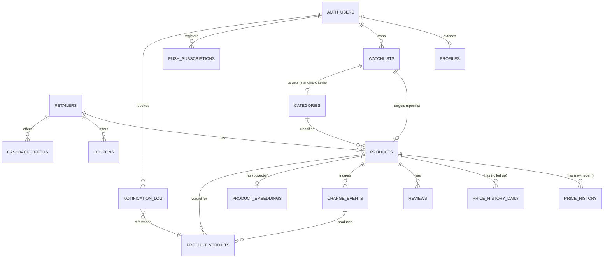

# Database Design
## AI Shopping Intelligence Platform — Saudi Arabia → MENA

| | |
|---|---|
| **Status** | Draft v1.0 — Awaiting founder review |
| **Phase** | 4 of 10 — Database |
| **Last updated** | 2026-07-10 |
| **Depends on** | `PRD.md` (Phase 1) · `ARCHITECTURE.md` (Phase 2) · `DEPLOYMENT.md` (Phase 3) |
| **Next document** | `AI_AGENTS.md` (Phase 5) |

> **Governance note.** This is the schema for a **single Supabase Postgres instance** doing relational storage + full-text search + vector search (per `ARCHITECTURE.md` §3.2/§7.2/§7.3 — the founder-approved deviation from separate Meilisearch/Elastic/vector-DB services). Every table here must work within Supabase's **free-tier 500MB database cap** (`DEPLOYMENT.md` §3) — this is not a soft target, it's load-bearing for the platform staying genuinely $0. §7 below exists specifically because naive unlimited-growth price history would blow through that cap within roughly a year at MVP scale — this document treats that as a real constraint to design around, not a future problem.

---

## 1. Design Principles

1. **Postgres does three jobs, not one.** Relational storage, full-text search (`tsvector`/GIN), and vector similarity (`pgvector`/HNSW) all live in the same database — no sync lag between "the data" and "the search index" because they're the same table.
2. **Price history is append-only, but not infinite.** Every price check writes a new row (never overwrites — PRD FR-2), but raw granularity is bounded by a retention window (§7); older data is downsampled, not deleted outright, preserving the *shape* of history within the 500MB budget.
3. **AI verdicts are versioned and auditable, not overwritten.** Each `product_verdicts` row references the exact `change_event` and data snapshot that produced it (PRD NFR-Auditability) — the AI layer never mutates a past verdict, it writes a new one.
4. **The scheduler's intelligence lives in the schema, not in code.** `popularity_score`, `volatility_score`, and `next_due_at` on `products` are what `ARCHITECTURE.md` §3.5's scheduler API query reads from — this is a database design decision, not just an application detail.
5. **Row-Level Security (RLS) is the access-control layer**, not application code — every user-owned table (`watchlists`, `push_subscriptions`, `notification_log`, `profiles`) enforces `auth.uid() = user_id` at the database level, so a bug in API code can't leak one user's data to another.
6. **All monetary values carry an explicit currency**, even though SAR is the only currency at MVP — this avoids a schema migration when regional expansion (PRD §9 Phase D) introduces AED/other currencies.

---

## 2. Entity Overview

---

## 3. Reference Tables

### `retailers`
| Column | Type | Notes |
|---|---|---|
| `id` | `uuid` PK | |
| `slug` | `text` unique | `amazon_sa`, `noon`, `jarir`, `extra` |
| `name_en`, `name_ar` | `text` | Bilingual display (PRD FR-19) |
| `base_url` | `text` | |
| `logo_url` | `text` | nullable |
| `worker_workflow` | `text` | GitHub Actions workflow filename (traceability to `ARCHITECTURE.md` §3.4) |
| `is_active` | `boolean` default `true` | admin can pause a retailer (FR-23) without deleting data |

### `categories`
| Column | Type | Notes |
|---|---|---|
| `id` | `uuid` PK | |
| `slug` | `text` unique | `laptops`, `smartphones`, `home-appliances` ... |
| `name_en`, `name_ar` | `text` | |
| `parent_id` | `uuid` FK → `categories.id`, nullable | supports subcategories |

---

## 4. Core Product & Pricing Tables

### `products`
| Column | Type | Notes |
|---|---|---|
| `id` | `uuid` PK | |
| `retailer_id` | `uuid` FK → `retailers.id` | |
| `retailer_product_id` | `text` | retailer's own SKU/ASIN-equivalent — used for scraper dedupe |
| `url` | `text` | source product page |
| `category_id` | `uuid` FK → `categories.id`, nullable | |
| `title_en`, `title_ar` | `text` | `title_ar` nullable if not yet translated/found |
| `image_url` | `text` | nullable |
| `current_price` | `numeric(10,2)` | denormalized latest price — avoids a join to `price_history` for every product-list render |
| `currency` | `char(3)` | ISO 4217, `SAR` at MVP |
| `in_stock` | `boolean` | |
| `rating_avg` | `numeric(2,1)` | nullable, denormalized from `reviews` |
| `rating_count` | `integer` default `0` | |
| **Scheduler fields** (`ARCHITECTURE.md` §3.5) | | |
| `popularity_score` | `real` default `0` | proxy: watchlist count + view count, computed periodically |
| `volatility_score` | `real` default `0` | variance of recent `price_history` entries |
| `check_interval` | `interval` default `'24 hours'` | shrinks/grows based on the two scores above |
| `last_checked_at` | `timestamptz` | nullable until first scrape |
| `next_due_at` | `timestamptz` | `last_checked_at + check_interval`; **indexed** — this is the column the scheduler API query sorts by |
| `is_active` | `boolean` default `true` | soft-delist without losing history |
| `created_at`, `updated_at` | `timestamptz` | |

**Indexes:** `(retailer_id, next_due_at)` — the exact shape of `ARCHITECTURE.md` §3.5's "give me the top-N due products for retailer X" query. `GIN (to_tsvector('simple', title_en || ' ' || coalesce(title_ar,'')))` for full-text search (FR-18). `(category_id)`.

### `price_history` (raw, recent — see §7 for retention)
| Column | Type | Notes |
|---|---|---|
| `id` | `bigserial` PK | `bigserial` not `uuid` — this table has the highest row count in the system, and a sequential int is smaller and faster to index than a uuid at this volume |
| `product_id` | `uuid` FK → `products.id` | |
| `price` | `numeric(10,2)` | |
| `currency` | `char(3)` | |
| `in_stock` | `boolean` | |
| `scraped_at` | `timestamptz` | |

**Append-only — no updates, no soft-deletes.** Rows older than the retention window (§7) are rolled up into `price_history_daily` and then deleted from this table.

**Index:** `(product_id, scraped_at DESC)` — supports both "give me this product's chart" and the rollup job's window scan.

### `price_history_daily` (rolled-up, long-term)
| Column | Type | Notes |
|---|---|---|
| `id` | `bigserial` PK | |
| `product_id` | `uuid` FK → `products.id` | |
| `day` | `date` | |
| `open_price`, `close_price`, `min_price`, `max_price` | `numeric(10,2)` | OHLC-style daily summary — enough to render a meaningful long-range chart (FR-17) without raw-row volume |
| `currency` | `char(3)` | |

**Unique constraint:** `(product_id, day)`. **Index:** `(product_id, day DESC)`.

### `product_embeddings`
| Column | Type | Notes |
|---|---|---|
| `product_id` | `uuid` PK, FK → `products.id` | one embedding per product at MVP (title + description composite) |
| `embedding` | `vector(1536)` | `pgvector`; dimension matches the embedding model chosen in `packages/ai` |
| `updated_at` | `timestamptz` | recomputed only when title/description materially changes — same incremental-cost principle as FR-14 |

**Index:** `HNSW (embedding vector_cosine_ops)` — per `ARCHITECTURE.md` §3.2, adequate to ~5–10M vectors, orders of magnitude above MVP volume.

---

## 5. Deals, Coupons & Reviews

### `coupons`
| Column | Type | Notes |
|---|---|---|
| `id` | `uuid` PK | |
| `retailer_id` | `uuid` FK | |
| `code` | `text` | |
| `description_en`, `description_ar` | `text` | |
| `discount_type` | `text` check `in ('percent','fixed_amount','free_shipping')` | |
| `discount_value` | `numeric(10,2)` | nullable for `free_shipping` |
| `valid_from`, `valid_until` | `timestamptz` | nullable if unknown |
| `is_verified` | `boolean` default `false` | flips true/false as the coupon worker re-validates it (PRD FR-4 — "validate automatically, not just on user report") |
| `last_validated_at` | `timestamptz` | |
| `source_url` | `text` | |

**Index:** `(retailer_id, is_verified, valid_until)`.

### `cashback_offers`
| Column | Type | Notes |
|---|---|---|
| `id` | `uuid` PK | |
| `retailer_id` | `uuid` FK | |
| `provider_name` | `text` | e.g. a cashback portal name |
| `rate_percent` | `numeric(5,2)` | |
| `valid_from`, `valid_until` | `timestamptz` | nullable |
| `terms_url` | `text` | |

### `reviews`
| Column | Type | Notes |
|---|---|---|
| `id` | `uuid` PK | |
| `product_id` | `uuid` FK | |
| `source` | `text` check `in ('retailer','youtube','reddit','x','tiktok')` | native reviews at MVP; social sources are V2 (PRD §9) but the column exists now so no migration is needed later |
| `author_handle` | `text` | nullable — **note:** may contain personal data (PDPL scope, `PRD.md` §4/§11) — no real names stored beyond what the source itself publishes publicly |
| `rating` | `numeric(2,1)` | nullable (not all sources have star ratings) |
| `content` | `text` | |
| `sentiment` | `text` check `in ('positive','neutral','negative')`, nullable | populated by AI synthesis (FR-12), not the worker |
| `source_url` | `text` | |
| `scraped_at` | `timestamptz` | |

**Index:** `(product_id, source)`.

---

## 6. AI Intelligence Tables

### `change_events`
The gate that gives FR-14 ("re-run AI analysis only when data materially changes") its teeth.

| Column | Type | Notes |
|---|---|---|
| `id` | `uuid` PK | |
| `product_id` | `uuid` FK | |
| `event_type` | `text` check `in ('price_drop','price_rise','stock_change','new_coupon','rating_change')` | |
| `old_value`, `new_value` | `jsonb` | shape varies by `event_type` — e.g. `{"price": 199.00}` |
| `detected_at` | `timestamptz` | |
| `status` | `text` check `in ('pending','processed','skipped')` default `'pending'` | polled by the AI re-analysis trigger (`ARCHITECTURE.md` §3.10); `'skipped'` covers the case where the 50/day OpenRouter cap is hit (`ARCHITECTURE.md` §8b) — the raw event is preserved, not lost, and is retried once quota resets |
| `processed_at` | `timestamptz` | nullable |

**Index:** `(status, detected_at)` — the exact query shape the AI trigger/poller needs.

### `product_verdicts`
| Column | Type | Notes |
|---|---|---|
| `id` | `uuid` PK | |
| `product_id` | `uuid` FK | |
| `change_event_id` | `uuid` FK → `change_events.id`, nullable | nullable only for the very first verdict on a newly-added product, which has no prior change event |
| `verdict_type` | `text` check `in ('buy_now','wait','buy_alternative')` | FR-9 |
| `reasoning_en`, `reasoning_ar` | `text` | human-readable explanation — FR-9/FR-12, and the PRD's core "explainable, not a black box" principle |
| `alternative_product_id` | `uuid` FK → `products.id`, nullable | populated when `verdict_type = 'buy_alternative'` (FR-10) |
| `confidence` | `real` | model's self-reported confidence — surfaced in UI per the PRD's "never overstate certainty" risk mitigation |
| `model_used` | `text` | which OpenRouter free model produced this (traceability, and useful for debugging quality issues per model) |
| `data_snapshot` | `jsonb` | the price/review/coupon data the model was actually given — this is what makes the verdict auditable after the fact, even if `price_history` rows have since rolled up (§7) |
| `generated_at` | `timestamptz` | |

**Index:** `(product_id, generated_at DESC)` — "give me this product's current verdict" is always "most recent row."

---

## 7. Data Retention & Growth Management (free-tier capacity constraint)

**Why this section exists:** at MVP's estimated 1,000–5,000 checks/day (`ARCHITECTURE.md` §7's freshness targets), raw `price_history` alone accumulates roughly 1,000–5,000 rows/day. Over a year that's 350K–1.8M rows — at realistic row+index overhead, this alone could approach or exceed Supabase's **500MB free-tier database cap** (`DEPLOYMENT.md` §3), before counting `reviews`, `change_events`, `product_verdicts`, or `product_embeddings` (each embedding row alone is ~6KB at 1536 dimensions). This is a concrete, load-bearing constraint, not a hypothetical.

**Design:**
1. **Raw `price_history` retention window: 180 days.** Full-resolution price points (every scrape) are kept for 6 months — enough for the PRD's price-history-chart feature (FR-17) to show genuine recent granularity, and enough for volatility scoring (§4) to have real signal.
2. **Nightly rollup job** (a GitHub Actions workflow, alongside `backup.yml` from `DEPLOYMENT.md` §5): for any `price_history` row older than 180 days, compute/upsert the corresponding `price_history_daily` row (open/close/min/max for that product+day), then delete the raw row. This keeps the *shape* of long-term history (FR-2's "full price history" requirement is satisfied at daily granularity for older data, not deleted outright) while bounding raw-table growth to a rolling 180-day window regardless of how long the product has been tracked.
3. **`change_events`** older than 90 days and already `status = 'processed'` are deleted outright (not rolled up) — they're an internal trigger mechanism, not user-facing history; `product_verdicts` already preserves the auditable outcome.
4. **`reviews`** has no automatic pruning at MVP (volume is much lower than price checks — reviews don't change every scheduler cycle) — revisit only if volume assumptions change once social-source workers (V2, PRD §9) go live.
5. **Graduation trigger:** if/when the project moves to Supabase Pro (`ARCHITECTURE.md` §4's graduation trigger for the database itself — "DB > 500MB"), the 180-day window can be extended or removed entirely; this is a config change (the rollup job's window parameter), not a schema change.

---

## 8. User & Notification Tables

### `profiles` (extends Supabase `auth.users`)
| Column | Type | Notes |
|---|---|---|
| `id` | `uuid` PK, FK → `auth.users.id` | |
| `display_name` | `text` | nullable |
| `locale` | `text` default `'ar'` | `'ar'` or `'en'` — PRD FR-19 |
| `notification_channels` | `jsonb` default `'{"push": true, "email": true}'` | FR-16/FR-20 |
| `quiet_hours` | `jsonb` | nullable, e.g. `{"start": "22:00", "end": "08:00"}` — FR-20 |
| `created_at` | `timestamptz` | |

**RLS:** `auth.uid() = id` for select/update.

### `watchlists`
| Column | Type | Notes |
|---|---|---|
| `id` | `uuid` PK | |
| `user_id` | `uuid` FK → `auth.users.id` | |
| `type` | `text` check `in ('specific_product','standing_criteria')` | FR-15 |
| `product_id` | `uuid` FK → `products.id`, nullable | set when `type = 'specific_product'` |
| `criteria` | `jsonb`, nullable | set when `type = 'standing_criteria'`, e.g. `{"category_id": "...", "max_price": 3000, "min_rating": 4.0}` — the "any laptop under 3000 SAR" example from the PRD |
| `created_at` | `timestamptz` | |

**RLS:** `auth.uid() = user_id` for all operations. **Index:** `(user_id)`; `(product_id)` for the recommendation matcher's reverse lookup (`ARCHITECTURE.md` §3.10).

### `push_subscriptions`
| Column | Type | Notes |
|---|---|---|
| `id` | `uuid` PK | |
| `user_id` | `uuid` FK → `auth.users.id` | |
| `endpoint` | `text` | Web Push subscription endpoint |
| `keys` | `jsonb` | `p256dh`/`auth` keys per the Web Push standard |
| `created_at` | `timestamptz` | |

**RLS:** `auth.uid() = user_id`.

### `notification_log`
| Column | Type | Notes |
|---|---|---|
| `id` | `uuid` PK | |
| `user_id` | `uuid` FK | |
| `verdict_id` | `uuid` FK → `product_verdicts.id` | |
| `channel` | `text` check `in ('push','email')` | |
| `status` | `text` check `in ('sent','failed','skipped_quota')` | `'skipped_quota'` covers Resend's 100/day cap (`ARCHITECTURE.md` §6) |
| `sent_at` | `timestamptz` | |

**Purpose:** audit trail, and **dedupe** — the recommendation matcher checks this table before sending, so the same verdict never re-notifies the same user twice. **RLS:** `auth.uid() = user_id` for select (system/service-role writes).

---

## 9. Admin & Ops Table

### `worker_runs`
| Column | Type | Notes |
|---|---|---|
| `id` | `uuid` PK | |
| `retailer_id` | `uuid` FK, nullable | null for non-retailer workers (coupon/cashback) |
| `worker_name` | `text` | matches the GitHub Actions workflow name |
| `started_at`, `finished_at` | `timestamptz` | |
| `status` | `text` check `in ('success','partial','failed')` | |
| `items_processed` | `integer` | |
| `error_message` | `text` | nullable |

**Purpose:** FR-21 (admin worker-health visibility) — the `/admin` route (`ARCHITECTURE.md` §8.3) reads this table directly; each GitHub Actions worker run writes one row on completion (success or failure) via the service-role key. **RLS:** readable only by users with an `admin` role claim (checked via Supabase Auth custom claims), writable only by the service role.

---

## 10. Migration Strategy

Per `DEPLOYMENT.md` §9 ("all migrations must be reversible, versioned files from day one"): every schema change ships as a numbered Supabase migration file (`supabase/migrations/<timestamp>_<name>.sql`) with an explicit `-- down` counterpart tracked in the same file or a paired rollback script — applied via `supabase db push` from CI, never hand-edited directly on the production project. The initial migration creates every table in this document in dependency order (reference tables → products → dependent tables → RLS policies).

---

## 11. Traceability to PRD & Architecture

| PRD/Architecture requirement | Table(s) |
|---|---|
| FR-1–FR-8 (data collection) | `products`, `price_history`, `coupons`, `cashback_offers`, `reviews`, `worker_runs` |
| FR-9–FR-14 (AI intelligence) | `change_events`, `product_verdicts`, `product_embeddings` |
| FR-15–FR-20 (user-facing) | `watchlists`, `profiles`, `push_subscriptions`, `notification_log`, `price_history_daily` |
| FR-21–FR-23 (admin/ops) | `worker_runs`, `retailers.is_active` |
| `ARCHITECTURE.md` §3.5 (scheduler) | `products.popularity_score/volatility_score/next_due_at` |
| `ARCHITECTURE.md` §3.6 (AI layer) | `product_verdicts.model_used`, `change_events.status = 'skipped'` (quota handling) |
| `DEPLOYMENT.md` §3 (500MB cap) | §7 retention design |

---

## 12. Open Questions for Phase 5

1. **Embedding model/dimension:** `product_embeddings.embedding vector(1536)` assumes a 1536-dimension model (OpenAI/Cohere-style default). Since the AI layer now runs on OpenRouter free models (`ARCHITECTURE.md` §3.6), confirm which specific free embedding model `packages/ai` will use before Phase 5 locks in agent designs that depend on it — dimension mismatches are a schema migration, better decided once, not adjusted later.
2. Any product attributes beyond title/price/rating that matter enough to be first-class columns (rather than sitting inside a generic `jsonb` specs field) — e.g., brand, for a future "recommend alternative brand" feature? Low-stakes, defaults to a `specs jsonb` catch-all column on `products` if no strong preference.

---

## 13. Next Steps

1. Founder review — approve or annotate, especially §7 (retention design) since it's the one place this document trades off a PRD requirement's *literal* interpretation (infinite price history) for a *practical* one (180 days raw + indefinite daily rollups) to fit the $0 infrastructure budget.
2. Answer §12 if relevant (both have sensible defaults if skipped).
3. Upon approval → **Phase 5: `AI_AGENTS.md`** — the specialized agents (Deal Hunter, Price Hunter, Coupon Hunter, Review Analyst, etc.) that read/write these tables, and exactly how each maps to the `change_events` → `product_verdicts` pipeline.
